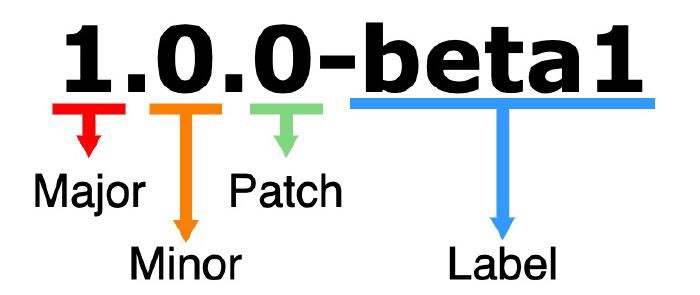

# How To Make Your Own NPM Package

## Accounts and Installations You Should Have Before Getting Started

Before getting started, make sure have the following set up:

- [`A GitHub account`](https://github.com/).
- [`An npm account`](https://www.npmjs.com/).
- Make sure that you have [`Node.js and npm installed`](https://docs.npmjs.com/downloading-and-installing-node-js-and-npm).

Once you have your accounts set up and and everything installed we can get started on making and publishing your npm package.

## Picking a Name For Your Package

If you are as picky as I am, this could be on of the hardest steps for you. Also, just when you think you have the best name possible, it could already be taken.

Before getting too attached to a name you can check wether the name you pick is available on the npm website or you can visit this website, input the name you like and it will tell you if it’s available: <https://remarkablemark.org/npm-package-name-checker/>

It is important that your package name is unique, especially if you plan on publishing it as a public package.

## Create a GitHub Repository For Your Package

Next create a new repository for your npm package on GitHub.The repository name for this example would be `my-girlfriend`. Make sure to initialize repository name properly with a README.

You may also want to choose an appropriate license for the repository as well. Especially if you are going to make your npm package public for other developers to use. A widely used one is the MIT license, but you can research on your own and find the right one for you. Check out the [`GitHub docs on licensing a repository.`](https://docs.github.com/en/github/creating-cloning-and-archiving-repositories/licensing-a-repository)

## Log In to the npm

After doing this, log in to npm with the command `npm login` . You will then be asked to put in the credentials you used to create the npm account.

## Initialize the Project

see [`package.json`](package.json) as example

- `package-name`
- `version`
- `description`
- `git repository`
- `keywords`
- `license`

## Make Sure You Update the Version of Your Package Correctly

You wont have to worry about this right away because the default version for the initial package you publish to npm should be 1.0.0. That being said, you should be aware of how to update the version ahead of time so that when you do update your package, you know you are doing it correctly.

As your public package gets installed, downloaded and utilized by developers around the world, and as the technology you use evolves and grows, you may want to update your npm package. When you update your package you will have to update the version.

Npm uses a versioning system called Semantic Versioning (SemVer) and as I mentioned, the default starting version is 1.0.0. For future updates to your package, there are three types of version changes you can make following Semantic Versioning standards. The three types of version changes are Major, Minor and Patch:



- **`Major`** version is when you make big changes to your package. An example is incompatible API changes.
- **`Minor`** version is when you add functionality in a backwards compatible manner.
- **`Patch`** version is when you make backwards compatible bug fixes.

Additional labels for pre-release and build metadata are available as extensions to the MAJOR.MINOR.PATCH format.

## Creating the Node Module

The next steps is implementing your package. In this example I am implementing the `my-girlfriend` package.

In `app.js` or whichever file you want to set as your entry point you would add the code that applies to your package. For the `my-girlfriend` package this is the code I placed in `app.js`:

```js
function helloWorld() {
 return `Hello World!`;
}

module.exports = helloWorld;
```

I used a simple function called `helloWorld` . It dose't accepts any params. The most important part of the code above is exporting the created function using module.exports.

## Initializing Git

Next your have to initialize git for your project/package using the command:

```shell
git init
```

Then stage the files that you changed using the command:

```shell
git add app.js
```

Next commit the changes to the code to your local repository:

```shell
git commit -m 'create `app.js`'
```

## Write a README for the Package

This may seem like an arbitrary or unnecessary step, but it is actually really important. How many times have you installed an npm package and then had to research online or look at examples of code to figure out how it works?

Writing a good README for your package can be a large contributor to its success and wide usage. It gives users and potential users of your package a rundown of what it does and how they can use it in their projects.

If you want to get a better idea of what a good npm package README looks like you should check out popular npm packages and their GitHub repositories.

In general, your README should include:

- A description of your package and what it does.
- How other users can install the package to use it in their project.
- How to use the package in a project. Give examples of code explaining the usage. This is important!
- How others can contribute to your package. If you expect other developers to contribute to this project, definitely include this in your README.
- The license used by the package.

## Publish the Package to NPM

This will be the simplest step. All you have to do is run the follow code in your command-line:

```shell
npm publish
```

Conclusion

I used a simple example, but as you get more comfortable with creating npm packages you can make them as complex as you see fit. In the end, once you understand the process and have tested it out, publishing an npm package is actually quite simple.

You now know what it takes to create your own npm package and publish it! Good luck, have fun and please feel free to share the npm packages you create with me.
